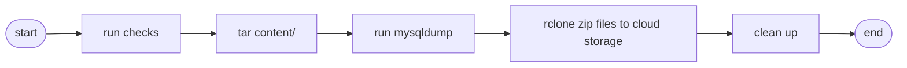

# Wraith

A simple utility Bash script to backup [Ghost](https://github.com/TryGhost/Ghost) publishing platform.

## Context

Getting started with Ghost is easy. You would pick between:

-   [Managed](https://ghost.org/pricing/) service
-   Self-hosted on a [VPS](https://marketplace.digitalocean.com/apps/ghost) or serverless platform like [Railway](https://blog.railway.app/p/ghost)

Using managed version will most likely save you a bunch of headaches (and time) that come along with self-hosting any other sites:

-   Backups
-   Maintenance
-   Downtime recovery
-   Security, etc.

In short, you’d sleep easy at night while they stay awake.

Having that said, if you want to take on the challenge of self-hosting your own Ghost site, here's a tiny script to help with your backups.

## Table of Contents

- [Wraith](#wraith)
  - [Context](#context)
  - [Table of Contents](#table-of-contents)
  - [Flowchart](#flowchart)
  - [Requirements](#requirements)
  - [Set up Rclone](#set-up-rclone)
  - [How to use](#how-to-use)
  - [Set up a Cron job](#set-up-a-cron-job)
  - [Testing and restoring backup](#testing-and-restoring-backup)
  - [FAQ](#faq)
    - [What to backup](#what-to-backup)
    - [What is the difference between Wraith and `ghost backup` command](#what-is-the-difference-between-wraith-and-ghost-backup-command)
  - [Contributing](#contributing)

## Flowchart

## Requirements

A list of CLI needed to be installed:

-   [`ghost`](https://ghost.org/docs/ghost-cli/)
-   [`mysql`](https://www.mysql.com/)
-   [`rclone`](https://rclone.org/install/)
-   [`gzip`](https://www.gnu.org/software/gzip/)
-   [`tar`](https://www.gnu.org/software/tar/)

## Set up Rclone

> Reference: [rclone.org](https://rclone.org/)

Install `rclone` using `curl -s https://rclone.org/install.sh | bash`

> **Note**
> An example to configure Rclone with Google Drive:

1. Run `rclone config`
2. Name your remote `remote`
3. Follow [rlcone.org/drive](https://rclone.org/drive/)
4. If you're working on a remote machine without a browser (e.g. Digital Ocean Droplet via SSH), say `N` for the auto config prompt. Follow through the instructions
5. Run `rclone lsd remote:/` to check your connection

## How to use

> **Note**
> Switch to the `ghost-mgr` user to manage Ghost using `sudo -i -u ghost-mgr`

1. SSH into your VPS where you host your Ghost site
2. [Set up Rclone](#set-up-rclone)
3. Clone this repository
4. Run [`./backup.sh`](backup.sh) from the repository directory

## Set up a Cron job

> Reference: [crontab.guru](https://crontab.guru/every-week)

1. Add a `crontab -e` item
2. For this example, we will back up the data every week: `0 0 * * 0 cd /$HOME/wraith/ && ./backup.sh`

## Testing and restoring backup

> Backups are not backups unless you have tested restoring from them.

Let's test our backup locally using [Docker](https://hub.docker.com/_/ghost).

1. At a new directory, copy your `ghost_content_YYYY_MM_DD_HHMM.tar.gz` backup file there. Decompress the backup files using `tar -xvf`
2. Run Ghost locally using `docker run -d --name some-ghost -e url=http://localhost:3001 -p 3001:2368 -v /path/to/images:/var/lib/ghost/content/images ghost` to restore the blog images
3. Visit [`localhost:3001/ghost`](http://localhost:3001/ghost) to create an admin account
4. From the Ghost Admin interface ([`localhost:3001/ghost/#/settings/labs`](http://localhost:3001/ghost/#/settings/labs)), import your JSON Ghost blog content from decompressed `data/`
5. You can import your members CSV from the Members page too

Tip: run `bash` within your Ghost Docker container using `docker exec -it some-ghost bash`

## FAQ

### What to backup

> Reference: [ghost.org/docs/ghost-cli/#ghost-backup](https://ghost.org/docs/ghost-cli/#ghost-backup)

1. Your content in JSON format
2. A full member CSV export
3. All themes that have been installed including your current active theme
4. Images, files, and media (video and audio)
5. A copy of `routes.yaml` and `redirects.yaml` or `redirects.json`
6. MySQL database

### What is the difference between Wraith and `ghost backup` command

Starting Ghost-CLI version: 1.21.0 they started supporting `ghost backup` command. However, the current `ghost backup` command does not support MySQL dump.

## Contributing

Please following the [Bash Coding Style repository](https://github.com/icy/bash-coding-style) for Bash coding conventions and good practices.

Pull requests are welcome. For major changes, please open an issue first to discuss what you would like to change.

1. Fork this
2. Create your feature branch (`git checkout -b feature/bar`)
3. Commit your changes (`git commit -am 'feat: add some bar'`, make sure that your commits are [semantic](https://www.conventionalcommits.org/en/v1.0.0/#summary))
4. Push to the branch (`git push origin feature/bar`)
5. Create a new Pull Request
